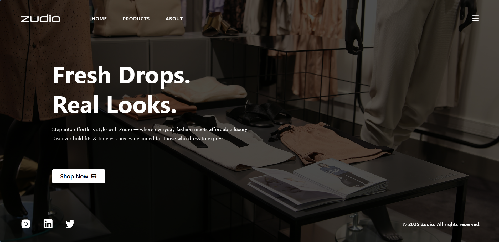
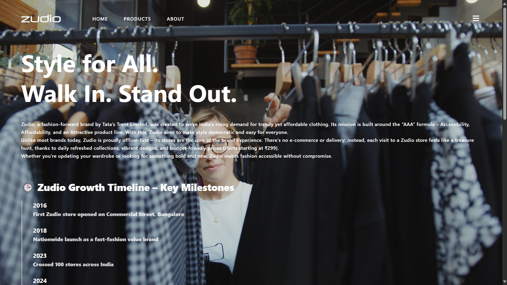
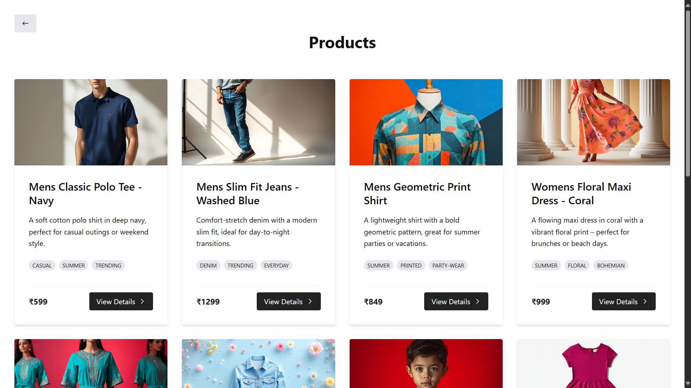
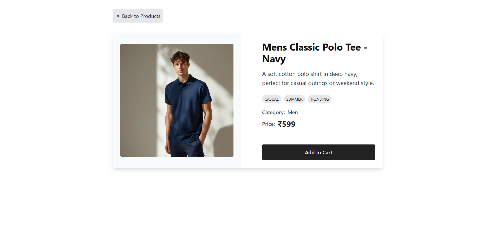
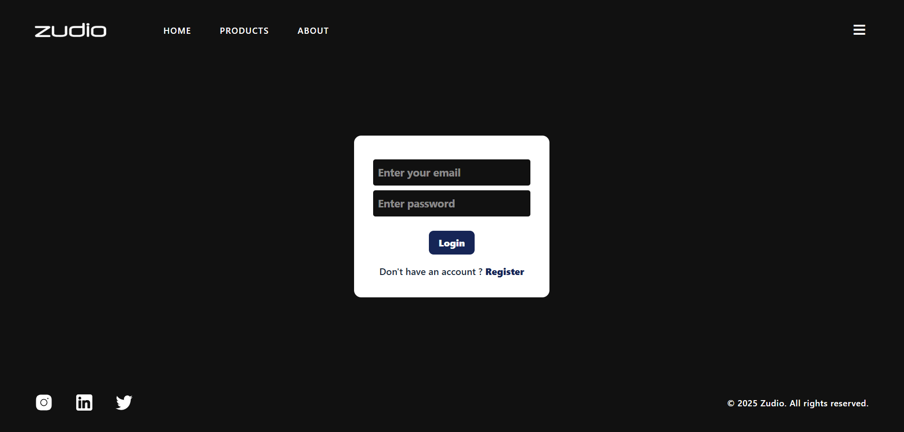
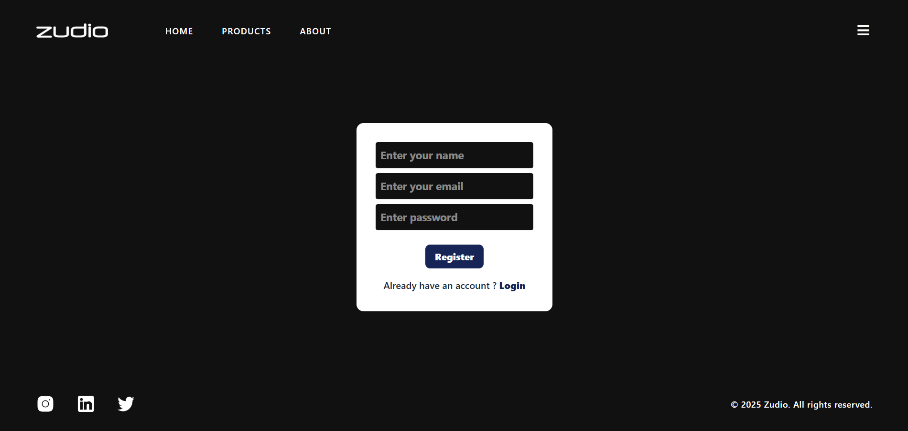
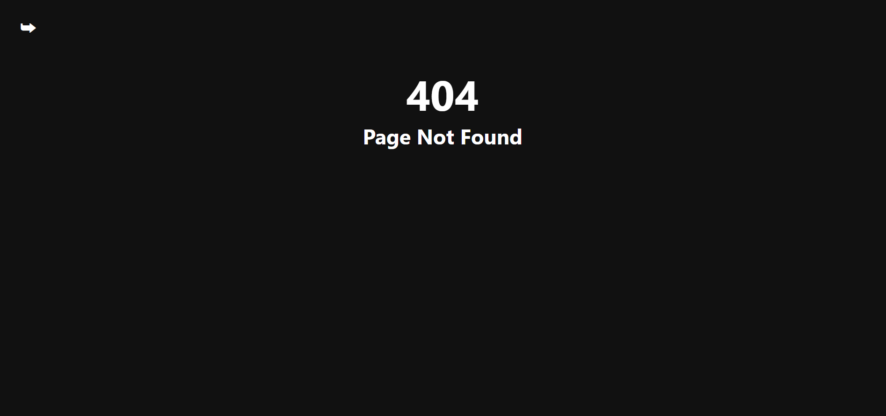

# Zudio - Your One-Stop Shop for All Your Clothing Needs

An animated and fully responsive web application for brand zudio built with **React**, **Framer Motion**, **Lenis smooth scrolling**, and **React Router v6**. This project includes user authentication, product browsing, animated page transitions, and detailed product views.

---

### Live Demo - [Zudio](https://zudio-five.vercel.app/)

## Tech Stack

| Frontend       | Animations            | State Management | Form Handling   | Notifications  |
| -------------- | --------------------- | ---------------- | --------------- | -------------- |
| React.js       | Framer Motion         | Context API      | React Hook Form | React Toastify |
| React Router   | GSAP (via context)    | —                | —               | —              |
| Tailwind / CSS | Lenis (smooth scroll) | —                | —               | —              |

## Features

- Smooth page transitions using **Framer Motion** + **AnimatePresence**
- Seamless scroll experience using **Lenis**
- Product listing and detailed product pages
- Authentication (Login/Register) flow
- 404 Page Not Found route
- Context API for global product state management
- Form handling and validation using **React Hook Form**
- Toast notifications using **React Toastify**
- Responsive UI across devices

---

## Folder Structure

├── zudio/
│ ├── public/
│ └── src/
│ ├── components/  
│ │ ├── Navbar.jsx
│ │ ├── Footer.jsx
│ │ └── PageTransition.jsx
│ │
│ ├── context/  
│ │ ├── ProductsProvider.jsx
│ │ └── GSAPProvider.jsx
│ │
│ ├── pages/  
│ │ ├── Home.jsx
│ │ ├── About.jsx
│ │ ├── Products.jsx
│ │ ├── ProductDetails.jsx
│ │ ├── Login.jsx
│ │ ├── Register.jsx
│ │ └── PageNotFound.jsx
│ │
│ ├── routes/  
│ │ └── Mainroutes.jsx
│ │
│ ├── App.jsx  
│ ├── index.css  
│ └── main.jsx

---

## Screenshots

- Home Page



- About Page



- Products Page



- Product Details Page



- Login Page



- Register Page



- PageNotFound Page



## Packages Used

`react-router-dom`
`framer-motion`
`react-hook-form`
`react-toastify`
`lenis`
`gsap`

## Installation & Setup

1. **Clone the repository**:

```bash
   git clone https://github.com/PrasadYeole-Developer/Zudio.git
   cd Zudio
```

2. Install dependencies:

```bash
   npm install
```

3. Run the development server:

```bash
   npm run dev
```
